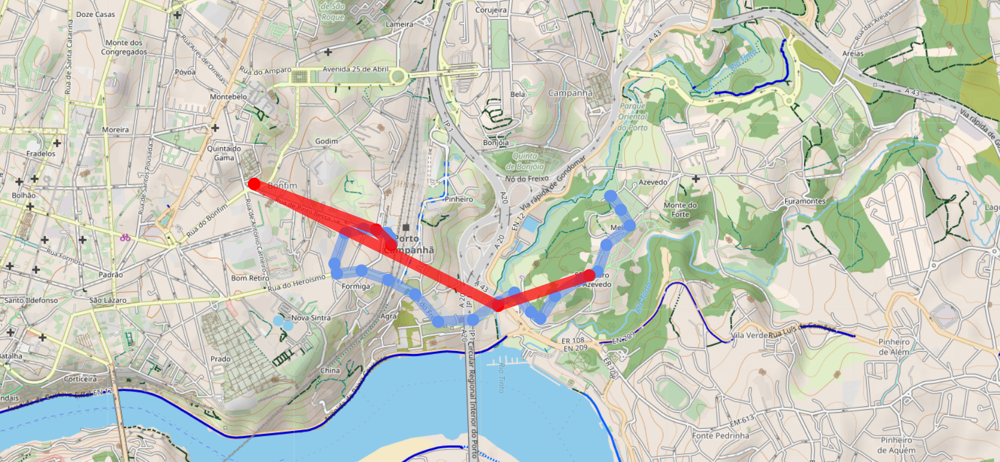
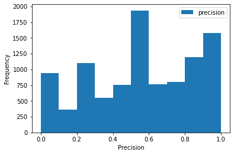
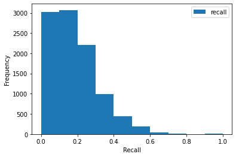
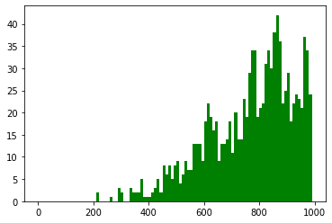
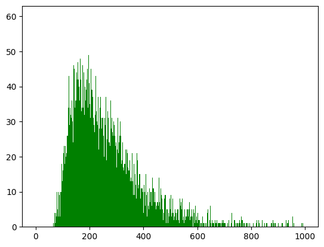
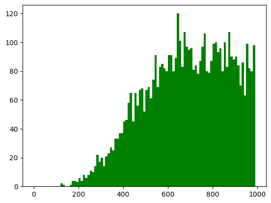
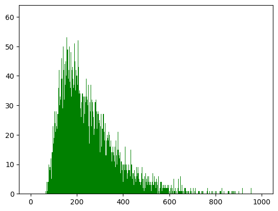

# Research project: Reversal of vehicle trajectory vectors

## Introduction

Deep learning of embedding vector representations of vehicle trajectories is currently very popular because the similarity between different vehicle trajectories is very difficult to compute by traditional methods, whereas if an efficient vector representation of vehicle trajectories is obtained using deep learning, it can be computed directly using existing methods for computing the similarity between vectors. However, such deep learning cannot be guaranteed in terms of security, because there is the same possibility of deep learning, which reverses the original vehicle driving trajectory by inputting the output of the above deep learning network, which makes the original data leakage.

And it is the possibility of this idea that I have explored in this research project. By using publicly available urban vehicle trajectory data and some already open-source deep learning models of vehicle trajectory embedding vectors, first we obtained the outputs of these networks. Subsequently, I constructed simple RNN (LSTM/GRU, etc.) models and tried to invert the obtained outputs, thus obtaining the approximate original trajectory, which was then able to be compared with the original trajectory.

An example of one comparison is shown below:



We can find that by simply reversing deep learning, we are able to get the original approximate path back from the output of a commonly used deep learning network.

## Experimental validation

In order to further quantitatively verify the effectiveness of the reversal network, we validated the model performance using the following common quantities.

+ Recall rate and Precision rate.

   !

  

+ Frechet distance, Hausdorff distance (and their corresponding normalised forms)

  **`Frechet distance` **

  

  **Frechet distance (standardised form) = $1000*\frac{frec\_distance}{diameters}$** !

  

  **`Hausdorff distance`** !

  

  **Hausdorff distance (standard form) = $1000*\frac{Hausdorff\_distance}{diameters}$** !

  

## Data and Embedding Model Source
```
D. Yao, G. Cong, C. Zhang and J. Bi, "Computing Trajectory Similarity in Linear Time: A Generic Seed-Guided Neural Metric Learning Approach," 2019 IEEE 35th International Conference on Data Engineering (ICDE), Macao, China, 2019, pp. 1358-1369, doi: 10.1109/ICDE.2019.00123. (NEUTRAJ) <br>
X. Li, K. Zhao, G. Cong, C. S. Jensen and W. Wei, "Deep Representation Learning for Trajectory Similarity Computation," 2018 IEEE 34th International Conference on Data Engineering (ICDE), Paris, France, 2018, pp. 617-628, doi: 10.1109/ICDE.2018.00062. (t2vec)<br>
Peng Han, Jin Wang, Di Yao, Shuo Shang, and Xiangliang Zhang. 2021. A Graph-based Approach for Trajectory Similarity Computation in Spatial Networks. In Proceedings of the 27th ACM SIGKDD Conference on Knowledge Discovery &amp; Data Mining (KDD '21). Association for Computing Machinery, New York, NY, USA, 556–564. https://doi.org/10.1145/3447548.3467337 (GTS)<br>
```


# 科研项目：车辆行驶轨迹向量的逆转


## Introduction

车辆行驶轨迹的嵌入向量(embedding vector)表示深度学习当前十分热门，因为不同车辆行驶轨迹之间的相似度传统计算方法存在很大困难，而如果使用深度学习得到车辆行驶轨迹的高效向量表示，就能够直接使用现有的向量间相似度计算方法直接进行计算。然而，这样的深度学习在安全性方面无法得到保证，因为同样存在着深度学习的可能性，其通过输入上述深度学习网络的输出，逆转得到原有的车辆行驶轨迹，这就使得原有的数据发生泄漏。

而在本次科研项目中，我正是探究了该思路的可能性。通过使用公开的城市车辆行驶轨迹数据和部分已经开源的车辆行驶轨迹嵌入向量深度学习模型，首先我们得到了这些网络的输出。随后，我构建了简单的RNN（LSTM/GRU等）模型，尝试对得到的输出进行逆转，进而得到大致的原始轨迹，该轨迹就能够和原轨迹进行比较。

一次比较示例如下图所示：


我们能够发现，通过简单的逆转深度学习，能够从常用深度学习网络的输出中回复得到原有的大致路径。

## 实验验证

为了进一步定量地验证该逆转网络地效果，我们使用以下的一些常用量进行了模型性能的验证:

+ Recall率以及Precision率

  

  

+ Frechet距离、Hausdorff距离（及其相应标准化形式）

  **`Frechet距离`**

  

  **Frechet距离（标准形式）=$1000*\frac{frec\_distance}{diameters}$**

  

  **`Hausdorff距离`**

  

  **Hausdorff距离（标准形式）=$1000*\frac{Hausdorff\_distance}{diameters}$**

  
